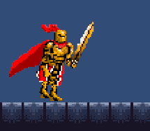
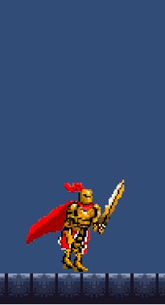
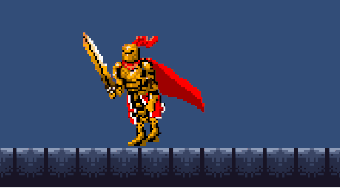
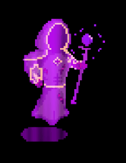
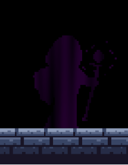
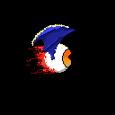
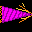
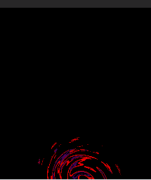
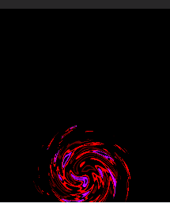

# :european_castle:Evercrescent:european_castle:

## Description

Evercrescent is a metroidvania game following the main protagonist, known as the hero, through their quest to save the fallen kingdom of Evercrescent from the evil overlord. It features 2 enemies within 4 unique rooms, aswell as a boss room, featuring the overlord boss fight. Use the heroes variety of skills, such as parrying, slashing, dashing and flying to make your way through the fallen kingdom of evercrescent and defeat the overlord. 

## Main Features
The player is able to run, parry, dash, attack and fly to explore and defeat enemies. With 40hp, the player can tank many enemy attacks, however boss attacks do lots of damage to the player.
### Controls
| Key | Action |
| ----------- | ----------- |
| W/Space | Fly |
| A | Walk Left |
| S | Fast Drop |
| D | Walk Right |
| Q | Dash |
| F | Parry |
| M1 | Attack |

### Actions

Dash

The player can dash left and right, allowing them to dodge attacks easily and cover large distances in a short amount of time. It can be activated by pressing the q key and has a short cooldown to avoid spamming.

---
Parry

The player can parry all enemies and projectiles by pressing the f key. Upon activating a parry, the player gains a small window of immunity frames, where all projectiles are destroyed and enemies are knocked back. After parrying, the player is left vulnerable, being unable to parry for a short cooldown.

---
Slash

The player can press the Mouse Button One (Left Click) to attack with their sword. This can be used to damage enemies and bosses. An attack buffer is also added so that slashes can be performed consecutively.

---
Flight

The Player can fly by holding S or Space. The player has a limited flight time, which can be regained by landing on the floor. Furthermore, the player can hold the s key to drop faster.

---
Running

The player can run left and right by holding the A and D keys respectively. Furthermore, the players sprite is split up into two segments, a top and bottom. This allows the player to attack and parry while running without resetting the animation.

## :japanese_ogre: Boss Fight :japanese_ogre:
Evercresent features a powerful boss known as the overlord. He has a full arsenal of attacks to utilise against the player, each with vastly different methods of surviving to keep the player on their toes at all times. It features 150 hp to make the boss more challenging. 

---

### Sprites

The boss fight has many sprites involve, including both itself, it's doppelganger and it's attacks.

---

This is the bosses sprite. It features a purple shader to represent its magical power.

---

This is the Doppelgangers sprite. It is a black silhouette with the same magic shader as the boss.

---

This is the eyeball projectile from attack 1 that homes in on the player.

---

This is the spike sprite used by every attack from the boss.

---

This is the portal sprite used for most attacks.

---

This is the portal sprite used for the first attack.

---

### Attacks

The boss can use a variety of attacks against the player at random. With 8 different attacks in the bosses arsenal, it is able to catch the player off guard if they are not focused.

In the first attack, the boss summons a portal that charges up for 4 seconds, before shooting 10 spikes around it. These spikes can be parried or dodged, however if they hit the wall, they turn into flying eyeballs that home onto the player. These eyeballs are far harder to dodge than the spikes, making well timed parries a necessity.

When using its second attack, the boss creates an image of itself ontop of the player, known as a doppelganger. The boss will teleport to the doppelgangers location a second after it appears and shoot 3 bursts of 3 spikes at the player. While doing this, it will summon another doppelganger to the left or right of the player and repeat until the attack ends. Parrying can be used against this attack, however it cant be relied on due to its cooldown.Therefor, dodging is required to survive this attack. 

The bosses third attack also utilises the doppelganger. The boss summons the doppelganger ontop of the boss, and after 1 second, the boss teleports to the doppelgangers location and shoots continous bursts of spikes towards the player. Parrying and dodging is required to survive this attack.

The fourth attack starts off with the floor disappearing and infinite flight being granted for the duration of the attack. This is done to provide more manoeuvrability to dodge the attack. It features portals spawning at a 12 unit radius away from the player at a random angle. Another portal will spawn opposite to that portal as a decoy. The main portal will spawn a line of 5 spikes that move quickly towards the other portal before disappearing. Constant fast movements are good for dodging this attack as moving will get you out of the way of majority of the portals.

The bosses fifth attack also removes the floor and gives the player infinite flight. This attack spawns a center portal on the player aswell as portals at a 20 unit radius on either side away from the centre portal that circle around the center for the duration of the attack. Each portal shoots spikes towards the centre circle, creating a circular dodging motion for the player. The player is advised to stay close to the centre of the attack as it means they have to moves less distance. They can also parry if they mess up, however parrying is risky due to the high damage of the attack.

The bosses sixth attack is very similar to the fifth attack. The difference is that the outside portals move at slower speeds, however there are now four portals shooting at once, instead of two. For this attack, it is better to stay further away from the centre. This is because the attack moves slower, meaning less distance in needed to be made. That means remaining on the outside provides more room to avoid the spikes.

Attack seven features the boss charging up a portal before it shoots spikes out in a circle. This attacks charge up phase is almost identical to attack 1, however less purple colouring is present in this attack so that the player can differentiate the two. Precise parry timing is necessary in order to dodge this attack.

## Future Updates
### More Enemies
In future updates, I plan to add more enemies to the game as I feel the game is lacking in variety. This will make the game more interesting and intense for the player, creating an overall more enjoyable experience
### Boss Update
I plan on adding a second phase to the boss, aswell as an updgrade to the bosses visuals, such as making it's shader slowly intensify as its health lowers.
### More Rooms
I plan on adding more rooms to my game as it currently lacks in exploration. This will make the game overall more enjoyable and engaging

## Acknowledgments

Gideon Young: Sprites
